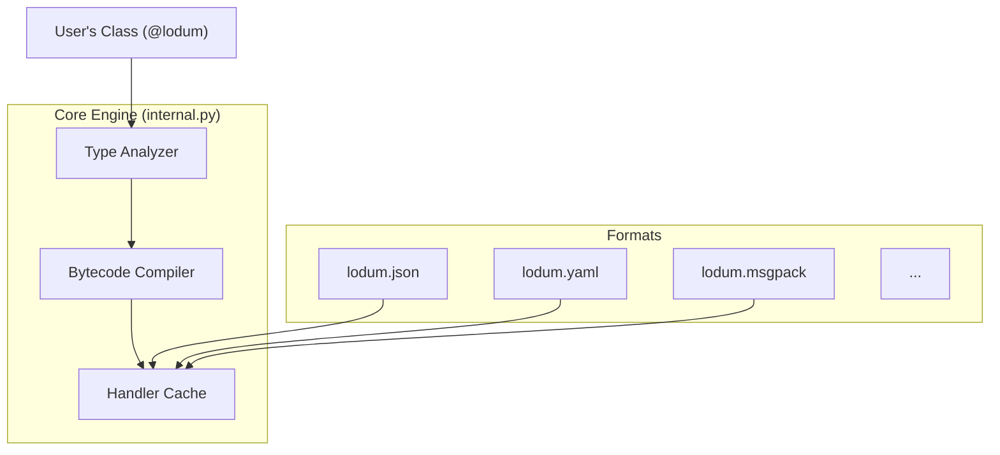

# Architecture of Lodum

This document explains the internal design and performance strategies of `lodum`. It is intended for contributors or power users who want to understand how the library works under the hood.

## Core Philosophy

`lodum` is designed around three principles:

1. **Protocol-First**: Serialization logic is decoupled from the data format.
2. **Runtime Compilation**: We generate specialized bytecode for your classes to avoid overhead.
3. **Declarative Data**: The `@lodum` decorator captures the "shape" of data once, and it is reused everywhere.

## High-Level Diagram



## 1. The Dynamic Bytecode Engine (`internal.py`)

The heart of `lodum` is in `src/lodum/internal.py`.

Unlike libraries that use generic introspection (looping over `__dict__` or using `getattr`) for every object, `lodum` inspects your class **once**.

1. **Analysis**: When you first call `dumps` or `loads`, the engine analyzes the type hints of your fields.
2. **Code Generation**: It constructs a Python string containing a highly optimized function specifically for that class.
    * *Example*: If your class has a `List[int]`, the generated code will check `isinstance(val, list)` directly and call the `int` loader for each item, typically unrolling standard overheads.
3. **Compilation**: `exec()` is used to compile this string into a real Python function object.
4. **Binding**: This function is cached and reused for all future operations.

**Why?** This approach gives us performance close to hand-written code or compiled extensions, while staying 100% pure Python.

## 2. The Abstract Protocols (`core.py`)

`lodum` uses two main protocols to bridge the gap between "Python Objects" and "Bytes/Strings".

### The `Dumper` Protocol

A `Dumper` knows how to take primitive types and write them to a specific format.

```python
class Dumper(Protocol):
    def dump_int(self, v: int) -> Any: ...
    def dump_str(self, v: str) -> Any: ...
    def begin_struct(self, cls: Type) -> Any: ...
    def end_struct(self) -> None: ...
```

### The `Loader` Protocol

A `Loader` knows how to read primitive types from a specific format.

```python
class Loader(Protocol):
    def load_int(self) -> int: ...
    def load_str(self) -> str: ...
    def load_list(self) -> Iterator['Loader']: ...
```

**Extensibility**: Because `internal.py` only talks to these protocols, adding a new format (like we did with CBOR) is as simple as implementing these methods. The optimization engine automatically works for the new format without any changes.

### Base Classes

To reduce boilerplate when implementing new formats, `core.py` also provides `BaseDumper` and `BaseLoader`. These classes provide default implementations for many protocol methods (such as handling primitive types), allowing format authors to focus on the unique aspects of their format.

## 3. Validation & Schemas

### Validation Pipeline

Validation is injected directly into the generated `loads` handler.

1. **Decode**: The value is read from the wire (e.g., JSON string -> Python `str`).
2. **Validate**: The value is passed to any validators defined in `field(validate=...)`.
3. **Instantiate**: Only if validation passes is the actual object created.

### Error Path Tracking

One of the key features of `lodum` is precise error reporting. During deserialization, the generated loaders maintain a `path` string that tracks the current position in the data structure.

* When entering a dictionary/struct, the path is appended with `.field_name`.
* When entering a list, the path is appended with `[index]`.

This path is passed down through recursive calls to `load()`. If a `DeserializationError` occurs (e.g., a type mismatch or a validation failure), the error captures the current `path`. This allows `lodum` to provide helpful error messages like `Error at users[2].address.city: Expected str, got int`.

### Schema Generation

`json.schema()` uses a recursive visitor pattern to walk the type hints of a `@lodum` class and construct a standard JSON Schema dictionary. This is separate from the serialization engine but shares the same type analysis logic.

## Directory Structure

* `src/lodum/`
  * `core.py`: Abstract Base Classes / Protocols.
  * `internal.py`: The Compiler and Execution Engine.
  * `field.py`: The `Field` definition and configuration logic.
  * `validators.py`: Built-in validation classes.
  * `json.py`, `yaml.py`, etc.: Format-specific implementations.
