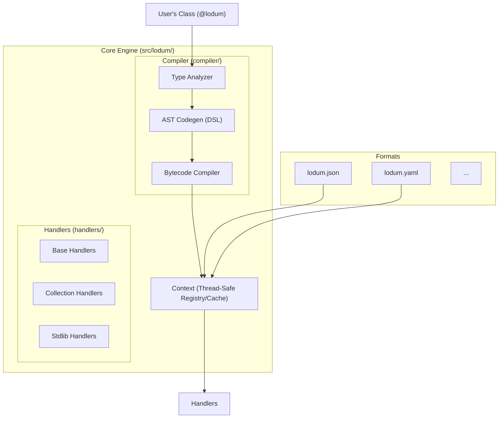

# Architecture of Lodum

This document explains the internal design and performance strategies of `lodum`. It is intended for contributors or power users who want to understand how the library works under the hood.

## Core Philosophy

`lodum` is designed around three principles:

1. **Protocol-First**: Serialization logic is decoupled from the data format.
2. **Runtime Compilation**: We generate specialized bytecode for your classes to avoid overhead.
3. **Declarative Data**: The `@lodum` decorator captures the "shape" of data once, and it is reused everywhere.

## High-Level Diagram



## 1. The Dynamic Bytecode Engine

The heart of `lodum` is its specialized compiler that generates optimized Python functions for your specific data models.

### AST Construction & DSL

Unlike libraries that use generic introspection (looping over `__dict__` or using `getattr`) for every object, `lodum` inspects your class **once** and compiles specialized handlers.

1. **Analysis**: When you first use a `@lodum` class, the `Analyzer` walks its type hints.
2. **DSL-based Codegen**: We use a specialized `ASTBuilder` DSL (`src/lodum/compiler/dsl.py`) to construct a Python Abstract Syntax Tree (AST). This DSL makes the complex code-generation logic readable and maintainable.
    * *Optimization*: If your class has a `List[int]`, the generated AST will include specialized nodes to check types and call primitive loaders directly, bypassing the overhead of generic dispatch.
3. **Compilation**: The AST is compiled into a code object using Python's built-in `compile()`. This avoids the security and fragility issues of string-based code generation.
4. **Binding & Caching**: The compiled function is stored in the `Context` and reused for all future operations.

**Why?** This approach gives us performance close to hand-written code or compiled extensions, while staying 100% pure Python.

## 2. Thread Safety & Context (`core.py`)

`lodum` is designed to be thread-safe by encapsulating all mutable state (registries, compiled handler caches, and name-to-type mappings) into a `Context` object.

* **Thread-Local Storage**: Each thread has its own active context, ensuring that compilation and registration in one thread doesn't interfere with another.
* **Lock-Free Fast Path**: To maintain high performance, cache lookups use a lock-free fast path. A mutex is only acquired during a cache miss to safely compile and register new handlers.

## 3. The Abstract Protocols

`lodum` uses two main protocols to bridge the gap between "Python Objects" and "Bytes/Strings".

### The `Dumper` Protocol

A `Dumper` knows how to take primitive types and write them to a specific format.

```python
class Dumper(Protocol):
    def dump_int(self, v: int) -> Any: ...
    def dump_str(self, v: str) -> Any: ...
    def begin_struct(self, cls: Type) -> Any: ...
    def end_struct(self) -> None: ...
```

### The `Loader` Protocol

A `Loader` knows how to read primitive types from a specific format.

```python
class Loader(Protocol):
    def load_int(self) -> int: ...
    def load_str(self) -> str: ...
    def load_list(self) -> Iterator['Loader']: ...
```

**Base Classes**: To reduce boilerplate, `core.py` provides `BaseDumper` and `BaseLoader` with standardized logic for type checking and error reporting (e.g., ensuring "Expected int, got str" across all formats).

## 4. Validation, Schemas & Error Paths

### Error Path Tracking

One of the key features of `lodum` is precise error reporting. During deserialization, the generated loaders maintain a `path` string.

* When entering a dictionary/struct, the path is appended with `.field_name`.
* When entering a list, the path is appended with `[index]`.

This allows `lodum` to provide helpful error messages like `Error at users[2].address.city: Expected str, got int`.

### Schema Generation

`lodum.schema(MyClass)` is the centralized entry point for generating JSON Schema definitions. It uses a recursive visitor pattern to walk type hints and construct a standard schema dictionary, which is then reused by formats like `json` and `yaml`.

## Directory Structure

* `src/lodum/`
  * `core.py`: Abstract Base Classes, Protocols, and `Context`.
  * `compiler/`: Analyzer, AST DSL, and Dump/Load codegen engines.
  * `handlers/`: Generic fallback handlers for Primitives, Collections, and Stdlib types.
  * `registry.py`: Registry logic for type handlers.
  * `field.py`: Field configuration and metadata logic.
  * `schema.py`: JSON Schema generation engine.
  * `internal.py`: Core dispatch logic and handler compilation.
  * `json.py`, `yaml.py`, etc.: Format-specific implementations.
